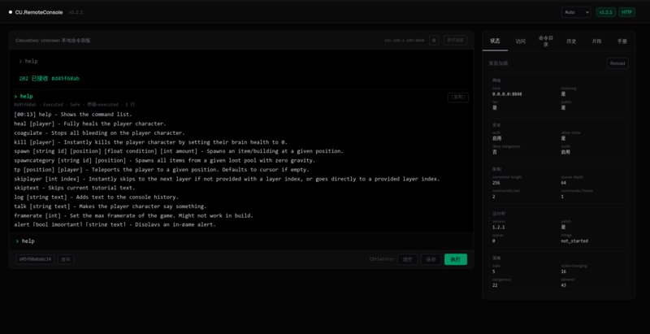

# CU.RemoteConsole

[English](./README.md) | 简体中文

面向 [Casualties: Unknown](https://store.steampowered.com/app/4576490/) 的 BepInEx 5 模组，提供本地带鉴权的浏览器/API 命令控制台。

> [!WARNING]
> CU.RemoteConsole 可以执行游戏控制台命令。请保持监听 `127.0.0.1`，保持鉴权开启，不要分享自动生成的 bearer token，也不要把服务直接暴露到公网。



## 功能

- **终端风格网页控制台**：`http://127.0.0.1:8848/`，深色主题 + 提示符输入。
- **登录/连接页**：先输入 bearer token 和可选端点，验证通过后进入主界面。
- **主机/Key 切换**：通过齿轮图标 ⚙ 即时修改端点和 token，无需刷新页面。
- **命令片段**：保存、编辑、搜索、快速执行常用命令（localStorage，最多 50 条）。
- **命令历史**：最近命令、回执查询、输出渲染。
- **命令目录**：按风险分组，悬停显示命令描述。
- **游戏内配置面板**：通过网页标题栏的 **Overlay** 按钮触发（不再使用 F8 快捷键）。
- Bearer token 鉴权。
- 安全命令白名单，危险命令默认拒绝。
- 基础速率限制和命令审计日志。
- 线程安全命令队列，由 Unity 主线程消费。
- 只读状态、配置和策略面板（侧边栏标签页）。
- 中英文命令手册，支持搜索。
- 中英文网页 UI，实时切换语言。
- 静态 OpenAPI 契约：[`docs/api/openapi.yaml`](./docs/api/openapi.yaml)。

## 工作方式

CU.RemoteConsole 不会在 HTTP/后台线程里调用游戏对象。

```text
浏览器 / 本地工具
  -> localhost HTTP API
  -> 鉴权 + Origin 检查 + 命令策略 + 审计
  -> 有界命令队列
  -> Unity 主线程消费
  -> ConsoleBridge
  -> 游戏控制台执行器
```

## 环境要求

| 项目 | 要求 |
| --- | --- |
| 游戏 | Casualties: Unknown / Casualties: Unknown Demo |
| Mod 加载器 | BepInEx 5.4.x |
| 运行时 | Unity Mono / `netstandard2.1` 插件构建 |
| 浏览器 | 同一台机器上的现代浏览器 |

Casualties: Unknown 可能支持部分自定义内容，但 CU.RemoteConsole 是 C# 插件，需要通过 BepInEx 加载。

## 安装

1. 为游戏安装 BepInEx 5.4.x。
2. 从 Release 页面下载 `CU.RemoteConsole-v1.2.0.zip`。
3. 把发布包里的整个 `BepInEx` 文件夹复制到游戏安装目录。
4. 确认最终插件路径类似：

```text
<GameDir>\BepInEx\plugins\CU.RemoteConsole\CU.RemoteConsole.dll
```

5. 启动一次游戏。
6. 打开：

```text
http://127.0.0.1:8848/
```

7. 从以下文件复制自动生成的 bearer token：

```text
<GameDir>\BepInEx\config\cu.remoteconsole.cfg
```

8. 粘贴 token 到登录页，点击 **Connect**。

不要分享或提交这个 token。

Proton / Steam Deck 备注：
如果通过 Proton 运行 Windows 版游戏时 BepInEx 没有加载，可以添加这个 Steam 启动选项：

```text
WINEDLLOVERRIDES=winhttp=n,b %command%
```

普通 Windows 安装不需要这个选项。

## 快速开始

1. 启动游戏并进入场景。
2. 打开 `http://127.0.0.1:8848/`。
3. 粘贴配置文件里的 bearer token。
4. 点击 **Connect**——控制台会验证连接并显示加载遮罩。
5. 在 `>` 提示符后输入 `help` 执行。
6. 通过侧边栏标签页浏览命令目录、历史和手册。
7. 点击标题栏的 **Overlay** 按钮打开游戏内配置窗口。

## 网页控制台

主面板采用终端风格，侧边栏为多标签页面板：

| 区域 | 用途 |
| --- | --- |
| **终端** | 在 `>` 提示符后输入命令（Ctrl+Enter 执行），查看输出和历史 |
| **Queue ID / Lookup** | 按队列 ID 查询命令回执 |
| **Status 标签页** | 监听器、鉴权、队列、速率限制、补丁和策略的只读状态 |
| **Commands 标签页** | 按安全/状态修改/危险/未知分组的命令目录，悬停显示描述 |
| **History 标签页** | 最近命令回执 + 已保存的片段（带搜索） |
| **Snippets 标签页** | 完整片段管理，支持快速执行、编辑、删除 |
| **Manual 标签页** | 可搜索的命令手册，中英文描述 |

会修改状态的命令和危险命令会展示出来，但默认拒绝执行。

标题栏的**齿轮图标 ⚙** 打开内联设置面板，可修改端点地址和 bearer token。点击 **Disconnect** 返回登录页。

已保存的片段、端点和语言偏好保存在浏览器 local storage。

## API

默认本地服务：

```text
http://127.0.0.1:8848
```

端点：

| 方法 | 路径 | 用途 |
| --- | --- | --- |
| `GET` | `/health` | 无鉴权健康检查 |
| `GET` | `/api/status` | 只读运行状态 |
| `POST` | `/api/commands` | 提交命令 |
| `GET` | `/api/commands` | 最近命令回执 |
| `GET` | `/api/commands/catalog` | 命令策略目录 |
| `GET` | `/api/commands/{queueId}` | 查询命令回执 |
| `POST` | `/api/toggle-overlay` | 开关游戏内配置面板 |

提交命令：

```bash
curl -H 'Authorization: Bearer <token>' \
  -H 'Content-Type: application/json' \
  -d '{"command":"help"}' \
  http://127.0.0.1:8848/api/commands
```

开关游戏内配置面板：

```bash
curl -X POST -H 'Authorization: Bearer <token>' \
  http://127.0.0.1:8848/api/toggle-overlay
```

静态 OpenAPI 契约：

```text
docs/api/openapi.yaml
```

## 配置

BepInEx 会在首次启动后自动生成配置文件。

点击网页标题栏的 **Overlay** 按钮（或发送 `POST /api/toggle-overlay`）可以打开 CU.RemoteConsole 配置窗口。窗口默认跟随系统语言，并提供中英文切换。本地玩家可以在这个窗口修改网络、鉴权、命令策略、命令允许列表、限制和审计设置。公网/局域网暴露、关闭鉴权、允许状态修改/危险命令、添加额外允许命令等高风险修改需要再次点击确认保存。

远程 API 用户不能通过 HTTP 修改配置。

| 文件 | 用途 |
| --- | --- |
| `<GameDir>\BepInEx\config\cu.remoteconsole.cfg` | 监听、鉴权、策略、队列、速率限制和审计设置 |
| `<GameDir>\BepInEx\config\cu.remoteconsole.audit.log` | 命令审计日志 |

重要默认值：

| 配置项 | 默认值 |
| --- | --- |
| `Network/BindAddress` | `127.0.0.1` |
| `Network/Port` | `8848` |
| `Security/RequireAuth` | `true` |
| `Security/AllowLan` | `false` |
| `Security/AllowPublic` | `false` |
| `Security/AllowStateChangingCommands` | `false` |
| `Security/DenyDangerousCommands` | `true` |
| `Security/ExtraAllowedCommands` | 空 |

## 从源码构建

构建前，先把 `GAME_DIR` 或 `CU_GAME_DIR` 设为你本机的 Casualties: Unknown 安装目录。

```bash
npm install
npm run build:web
dotnet build src/CU.RemoteConsole/CU.RemoteConsole.csproj -c Release
```

`build:web` 步骤会把模块化的 JavaScript 源文件（`web/src/js/`）通过 `web/build.mjs` 组装成单个 HTML，然后编译 Tailwind CSS，最后把全部内容嵌入 C# 插件的逐字字符串中。

常用脚本：

| 脚本 | 用途 |
| --- | --- |
| `scripts/build-plugin.sh` | 构建网页资源和 Release 插件 DLL |
| `scripts/install-local.sh` | 把构建好的 DLL 安装到本地游戏目录 |
| `scripts/smoke-test-local.sh` | 验证正在运行的本地游戏/插件实例 |
| `scripts/test-logic.sh` | 运行小型纯逻辑测试 |
| `scripts/package-release.sh` | 在 `dist/` 下生成本地发布包 |

`scripts/smoke-test-local.sh` 会在脚本内部读取 token，但不会打印 token。

## 网页源码结构

```
web/
  build.mjs                # JS 组装脚本（模板 → index.html）
  src/
    index.html.template    # HTML 模板，含 <!--INCLUDE js/...--> 标记
    index.html             # 组装产物（自动生成）
    input.css              # Tailwind CSS 入口
    js/
      i18n.js              # 国际化字典和语言辅助函数
      snippets.js          # 命令片段 CRUD（localStorage）
      manual.js            # 命令参考数据和渲染
      app.js               # 主应用逻辑
```

## 鸣谢

- [BepInEx](https://github.com/BepInEx/BepInEx) / [HarmonyX](https://github.com/BepInEx/HarmonyX)
- [Tailwind CSS](https://github.com/tailwindlabs/tailwindcss)
- [Newtonsoft.Json](https://www.newtonsoft.com/json)
- [Casualties: Unknown](https://store.steampowered.com/app/4576490/)

## 许可证

CU.RemoteConsole 使用 [MIT License](./LICENSE) 授权。

依赖和第三方内容说明见 [THIRD-PARTY-NOTICES.md](./THIRD-PARTY-NOTICES.md)。除非相关许可证明确允许，不要复制、修改、打包或二次分发第三方 Casualties: Unknown mod、Dev Menu 代码、资源、UI、游戏文件或 BepInEx 二进制文件。
